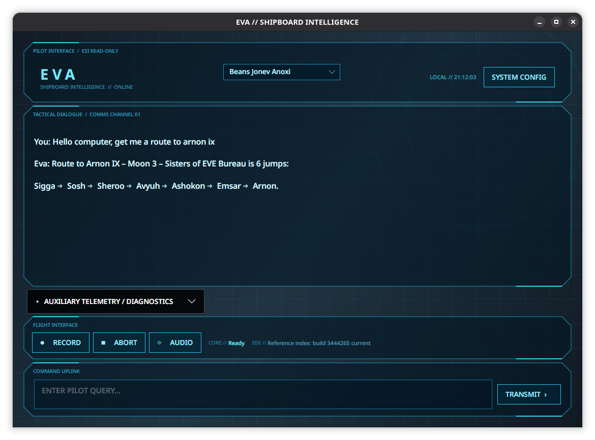

# Eva

Eva is a Linux-first, local-voice EVE Online assistant:

`voice → local transcription → Codex → eve-esi → Codex answer → local speech`



- `Eva.App`: Avalonia desktop client and local audio/Codex process bridges.
- `EveEsi.Cli`: bounded, read-only EVE ESI command-line client.
- `EveEsi.Core`: ESI HTTP, OAuth/PKCE, caching, and Secret Service support.
- `tests`: contract and safety tests.

## Build

The .NET SDK is pinned by `global.json`.

```sh
dotnet restore
dotnet build --no-restore
dotnet test --no-build
```

## CLI examples

```sh
dotnet run --project src/EveEsi.Cli -- help
dotnet run --project src/EveEsi.Cli -- universe system --id 30000142 --json
dotnet run --project src/EveEsi.Cli -- universe resolve --query Dodixie --kind system --json
dotnet run --project src/EveEsi.Cli -- market availability --item "Core Probe I" --location Dodixie --json
```

Character commands read refresh tokens from Linux Secret Service. Secrets never
appear in command arguments or output. Configure the EVE SSO client ID and
loopback callback in Eva Settings. Both the app and CLI read the same local
configuration; `EVA_EVE_CLIENT_ID` is only a fallback for an unconfigured
installation.

On startup Eva checks CCP's official JSONL static-data release and builds a
query-focused SQLite reference index in the local Eva data directory. The
existing index remains usable while a new build downloads and imports.

Eva defaults to the fast, affordable `gpt-5.6-luna` Codex model with low
reasoning effort. Model and reasoning defaults can be changed in Settings.

## Run the desktop app

For a development build:

```sh
dotnet run --project src/Eva.App
```

After `dotnet build`, Linuxbrew users can run:

```sh
./scripts/run-eva.sh
```

Install the fully local speech runtime and pinned models with:

```sh
brew install python@3.13
./scripts/setup-speech.sh
```

Eva keeps Faster-Whisper `distil-large-v3` resident on the GPU with automatic
CPU fallback, and uses a warm Piper voice worker for low-latency speech. Typed
chat and public ESI commands do not require these speech dependencies.

See [docs/architecture.md](docs/architecture.md) and
[docs/security.md](docs/security.md).
